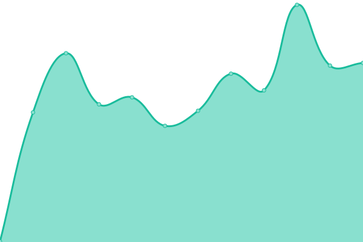

# [📈 Live Status](https://nightly-labs.github.io/rpc-status): <!--live status--> **🟧 Partial outage**

This repository contains the open-source uptime monitor and status page for [nightly-labs](https://nightly-labs.github.io/rpc-status), powered by [Upptime](https://github.com/upptime/upptime).

With [Upptime](https://upptime.js.org), you can get your own unlimited and free uptime monitor and status page, powered entirely by a GitHub repository. We use [Issues](https://github.com/nightly-labs/rpc-status/issues) as incident reports, [Actions](https://github.com/nightly-labs/rpc-status/actions) as uptime monitors, and [Pages](https://nightly-labs.github.io/rpc-status) for the status page.

<!--start: status pages-->
<!-- This summary is generated by Upptime (https://github.com/upptime/upptime) -->
<!-- Do not edit this manually, your changes will be overwritten -->
<!-- prettier-ignore -->
| URL | Status | History | Response Time | Uptime |
| --- | ------ | ------- | ------------- | ------ |
|  Nightly RPC | 🟥 Down | [nightly-rpc.yml](https://github.com/nightly-labs/rpc-status/commits/HEAD/history/nightly-rpc.yml) | 

 348ms
     
 | 

<a href="https://nightly-labs.github.io/rpc-status/history/nightly-rpc">99.17%</a>
    

|  Nightly RPC (Bare) | 🟩 Up | [nightly-rpc-bare.yml](https://github.com/nightly-labs/rpc-status/commits/HEAD/history/nightly-rpc-bare.yml) | 

 138ms
     
 | 

<a href="https://nightly-labs.github.io/rpc-status/history/nightly-rpc-bare">99.46%</a>
    

|  Reference non-indexed RPC | 🟩 Up | [reference-non-indexed-rpc.yml](https://github.com/nightly-labs/rpc-status/commits/HEAD/history/reference-non-indexed-rpc.yml) | 

 144ms
     
 | 

<a href="https://nightly-labs.github.io/rpc-status/history/reference-non-indexed-rpc">98.90%</a>
    

|  [Solana Endpoint](https://api.mainnet-beta.solana.com) | 🟩 Up | [solana-endpoint.yml](https://github.com/nightly-labs/rpc-status/commits/HEAD/history/solana-endpoint.yml) | 

 178ms
     
 | 

<a href="https://nightly-labs.github.io/rpc-status/history/solana-endpoint">100.00%</a>
    

|  [Google](https://www.google.com) | 🟩 Up | [google.yml](https://github.com/nightly-labs/rpc-status/commits/HEAD/history/google.yml) | 

 173ms
     
 | 

<a href="https://nightly-labs.github.io/rpc-status/history/google">100.00%</a>
    

<!--end: status pages-->

[**Visit our status website →**](https://nightly-labs.github.io/rpc-status)

## 📄 License

- Powered by: [Upptime](https://github.com/upptime/upptime)
- Code: [MIT](./LICENSE) © [nightly-labs](https://nightly-labs.github.io/rpc-status)
- Data in the `./history` directory: [Open Database License](https://opendatacommons.org/licenses/odbl/1-0/)
